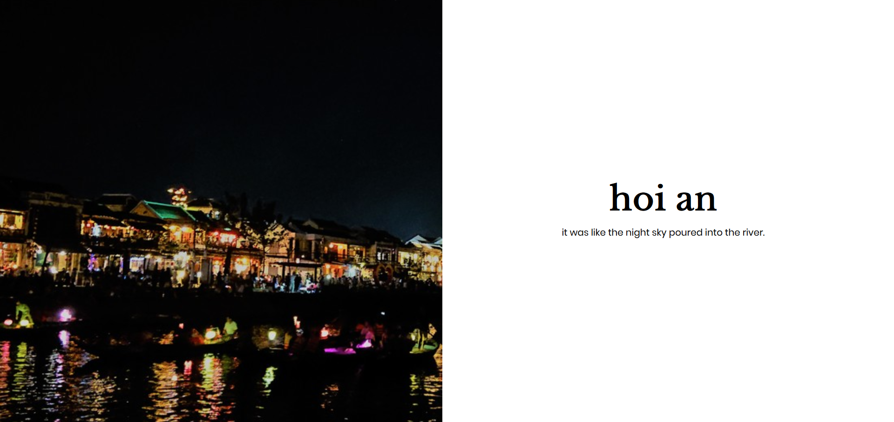

# Da Nang

a photo journey; danang 28042018 - 02052018 

inspired by [nytimes article](https://www.nytimes.com/interactive/2018/04/30/us/detroit-come-back-budget.html)

Todo:
- [x] Add transitions for images (fadeIn and fadeOut)
- [x] Mobile Responsiveness
- [x] Image Compression with jpegtran and imagick 

What it looks like on Desktop/Large Screens:

What it looks like on Mobile:

